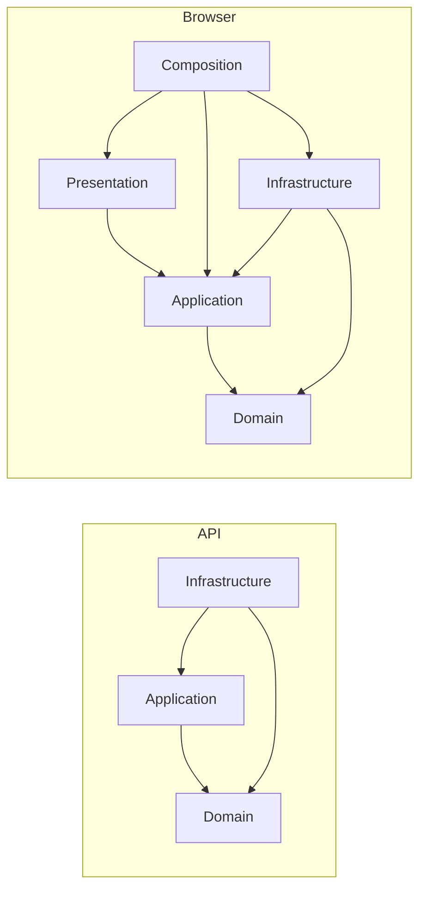
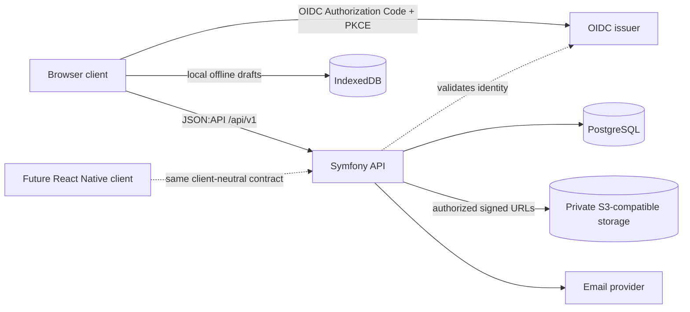

# Architecture Spine — Wrenchbase

This spine distills recorded decisions for future epics and stories. It does not
replace product authority in the approved PRD or visual and interaction
authority in the approved UX spines. `docs/architecture.md` remains in place as
the detailed architecture reference; section coverage is recorded in the
companion reconciliation.

## Design Paradigm

Use capability-first Clean Architecture inside the API and browser. Domain and
Application code depend inward; Infrastructure implements purpose-specific
ports; Composition wires concrete adapters. The API and clients meet only at a
versioned, client-neutral contract. A browser Domain exists only for real
client-owned behavior, such as offline drafts; API aggregates are not copied
into TypeScript.

## Invariants & Rules

### AD-1 — [ADOPTED] Capability-first dependency direction

- **Binds:** API and browser capability work; all future epics
- **Prevents:** Framework, persistence, transport, or presentation details leaking into domain and use-case code, and independently built capabilities using opposite import direction.
- **Rule:** Organize by capability, then layer. In the API allow `Infrastructure -> Application -> Domain` and `Infrastructure -> Domain`; keep Domain independent of Application, Infrastructure, and frameworks, and keep Application independent of Infrastructure and framework contracts. In the web client allow Presentation and Infrastructure to depend on Application and Domain; keep wire DTOs and browser adapters in Infrastructure. Composition alone wires concrete implementations. Keep browser and server compositions separate when their APIs or configuration differ. External capabilities use purpose-specific ports; invitation delivery commits through an outbox and a retryable worker so provider availability does not control the invitation request's success.



### AD-2 — [ADOPTED] API and client ownership

- **Binds:** `FR-1`–`FR-38`; browser and future native client
- **Prevents:** Duplicate business rules, authorization decisions, due-work calculations, or server persistence in a client.
- **Rule:** The Symfony API owns business rules, authorization, validation, persistence, Due Work, notification eligibility, report data, and authoritative publication. Clients own presentation and interaction. The browser owns local drafts and synchronization presentation. Keep Next.js delivery code thin; do not use Route Handlers or Server Functions as a second business backend. Use TanStack Query for browser server state, component state for simple UI state, and IndexedDB for meaningful offline data; do not recreate API aggregates as browser Domain objects.

### AD-3 — [ADOPTED] Workspace tenancy and authorization

- **Binds:** Every tenant-owned route, record, query, command, and asynchronous operation
- **Prevents:** Cross-Workspace reads, references, or mutations, and clients inferring authority from role labels.
- **Rule:** Every tenant record and operation carries one explicit Workspace scope. Workspace-scoped API paths identify that scope. Resolve the actor's named Capabilities and authorize before resource lookup; preserve the addendum's Capability identifiers and owner/member assignments as stable API contract strings. Clients use Capabilities returned by the API rather than infer access from role names; conceal cross-Workspace identifiers as not found. Enforce Workspace scope and same-Workspace references in repositories and relational constraints. Use PostgreSQL row-level security for tenant-domain tables from MVP 1 as defense in depth, with transaction-local Workspace context and a restricted runtime role; it does not replace API authorization. Control-plane tables are outside RLS.

### AD-4 — [ADOPTED] Provider-neutral identity

- **Binds:** Browser sign-in, API authentication, and future native sign-in
- **Prevents:** Identity-provider IDs or vendor SDK behavior becoming Wrenchbase identity or domain rules.
- **Rule:** Use standards-compliant OpenID Connect with Authorization Code and PKCE for browser and future native clients. The API validates issuer, audience, expiry, subject, and verified-email claims through an identity port. Link external identity by `(issuer, subject)`; synchronized profile fields are not identity keys. Never trust a provider user ID supplied in request data or persist provider access/refresh tokens in the API database. Keep browser token and request state session-scoped; only the last selected Workspace identifier may persist across browser sessions.

### AD-5 — [ADOPTED] Shared client-neutral API contract

- **Binds:** API capabilities and every browser or future native API consumer
- **Prevents:** Independently built clients choosing different routes, wire envelopes, identifiers, error semantics, or pagination behavior.
- **Rule:** Use `/api/v1` with JSON:API 1.1 and `application/vnd.api+json`; serialize application-generated UUIDv7 identifiers as canonical lowercase UUID strings. Keep public responses independent of Next.js. The API-owned capability contract documentation is canonical for each capability's routes, authorization, resource fields and relationships, commands, and errors; browser and future native consumers implement against that published contract instead of choosing independent shapes. Follow `docs/api-contract.md` for media types, field naming, dates and amounts, cursor order, stable errors, correlation IDs, and compatible evolution; a breaking contract change uses a new `/api/vN`.

### AD-6 — [ADOPTED] Concurrency-safe and retry-safe commands

- **Binds:** Mutable resources, create and publish commands, and multi-record operations (`FR-34`–`FR-35`)
- **Prevents:** Lost updates, duplicate effects after retry, and clients coordinating a domain invariant through partial writes.
- **Rule:** State-dependent mutations require the current representation's strong ETag in `If-Match` and persist with revision compare-and-swap. Keep missing preconditions (`428`), stale preconditions (`412`), semantic conflicts (`409`), and validation failures distinct. A failed precondition preserves the member's entered work (`FR-34`); the exact recovery interaction for missing `If-Match` remains UX-owned under `UX-OQ-6`. Create, publish, and multi-record commands accept an idempotency key; replay of the same operation and fingerprint returns its result, while reuse for a different request is rejected (`FR-35`). Compound domain commands validate and commit atomically and return the resulting representation.

### AD-7 — [ADOPTED] Typed, relational, and versioned domain definitions

- **Binds:** Sites, Locations, Asset Types, Assets, Meters, Schedules, Requirements, and configured values (`FR-6`–`FR-20`)
- **Prevents:** Flexible fields replacing relational ownership, definitions changing historical meaning, and independently implemented schedule evaluators.
- **Rule:** Keep core concepts and relationships relational. Represent configurable attributes, Meters, and schedule Triggers as typed definitions with stable identities; keep exact decimals, canonical measurements, stable choices, and accepting revisions interpretable. Asset Types and Maintenance Schedules have independent revision streams; publication freezes a revision. Use typed Trigger variants, not stored executable formulas. Model Components through Roles and dated Installations, not type inheritance or a timeless parent pointer. The API alone calculates Due Work; only completed Work Items explicitly mapped to Requirements reset them. The PRD and `docs/architecture.md` retain the domain detail; this spine does not prescribe final tables.

### AD-8 — [ADOPTED] Historical state keeps its original meaning

- **Binds:** Membership and invitation tenure, placement, Installation, lifecycle, Meter Reading, Baseline, schedule adoption, Jobs, Work Items, costs, Evidence, and reports (`FR-37`)
- **Prevents:** Current edits reinterpreting past work, overlapping placements, and corrections erasing provenance.
- **Rule:** Preserve dated Membership and invitation tenure, placement and Installation history, acyclic Location and concrete Asset trees, and one valid active placement per active Asset. Audited changes retain actor, time, Workspace, action, and relevant before-and-after context. Snapshot the relevant place, address, time zone, currency, requirement, and revision context when work completes. Store instants in UTC and calendar-only facts as dates; evaluate calendar recurrence in the Site's IANA time zone. Keep archived, retired, disposed, voided, and restorable-trash states distinct. Domain records and confirmed Evidence objects are never hard-deleted in the MVP; trash is restorable, and closed Jobs are corrected by explicit amendment or void with reason. Planning alone does not reset Due Work.

### AD-9 — [ADOPTED] Offline work remains a client draft until API publication

- **Binds:** Browser offline reading, draft Jobs, Meter Readings, attachments, replacement proposals, and synchronization (`FR-32`–`FR-33`)
- **Prevents:** A local completion appearing authoritative before validation, cross-Workspace replay, or guessed conflict merges.
- **Rule:** Keep meaningful offline data in IndexedDB with stable client-generated IDs, Workspace and author scope, dependencies, cached revisions, and explicit states `pending`, `syncing`, `synced`, `failed`, or `needs_review`. Retain local input and Evidence through failure. Do not persist drafts, tokens, or meaningful server data in `localStorage`; only the last selected Workspace identifier may persist across sessions. The first successful Job-draft upload creates an intermediate shared server draft, not a completed Job; its author remains its editor until explicit handoff. Workspace membership alone does not permit another member to overwrite it. Confirm attachments and dependent content before the API atomically publishes a completed Job; `docs/offline-sync.md` retains the detailed draft, handoff, upload, and publish sequence. Semantic conflicts require member review; clients never silently alter replacement, Schedule, Meter, or lifecycle state. Do not promise sync while the browser is closed. Keep Asset Type and Schedule authoring, and edits or deletes of existing records, online-only in v1. Offline Asset creation from cached existing Asset Types is approved product scope, but its publication protocol is an open gap in the focused offline contract recorded in `source-reconciliation.md`; implementation must wait for that contract to be reconciled.

### AD-10 — [ADOPTED] Attachments stay private and API-authorized

- **Binds:** Upload, confirmation, download, and retention of Evidence
- **Prevents:** Public object access, client-held bucket credentials, and linking unverified or cross-Workspace objects.
- **Rule:** Store bytes in private S3-compatible storage. The API authorizes each operation before issuing a short-lived, single-object signed URL; clients never receive storage credentials. Confirm object metadata through the API before linking Evidence to a Job or Work Item. Confirmed objects are immutable and remain with their domain records. Use `docs/api-contract.md` and `docs/security-and-data-lifecycle.md` for the upload sequence and security controls; do not treat listed formats or reference size limits as approved product bounds while PRD OQ-6 and UX-OQ-7 remain open.

### AD-11 — [ADOPTED] Portable deployment with explicit operational boundaries

- **Binds:** Development, hosted deployments, release, recovery, and background delivery
- **Prevents:** One cloud provider becoming a hidden runtime requirement and operational duties falling between API, web, and infrastructure work.
- **Rule:** Preserve the portable container baseline: separate API and web services, PostgreSQL, private S3-compatible object storage, configured OIDC, and outbound email. AWS ECS/Fargate is a reference deployment, not a product dependency. Keep secrets in deployment secret storage; terminate TLS at the deployment boundary; run schema migrations as a controlled release step; provide health checks, logs/metrics, PostgreSQL and object backups, isolated restore tests, and incident procedures. `docs/deployment.md` owns the runbook and environment detail.

## Consistency Conventions

| Concern | Convention |
| --- | --- |
| Code and ports | Organize by capability before layer. API use-case orchestrators use a `Handler` suffix; external capabilities use purpose-specific Application-owned ports. Browser request/response DTOs stay in Infrastructure and map to Application read models. |
| Identifiers and values | Use lowercase UUIDv7 IDs; JSON:API lower-camel attribute and relationship names; UTC RFC 3339 instants, ISO 8601 calendar dates, canonical measurements, and integer minor-unit money with ISO 4217 currency. |
| Mutations and errors | Use `If-Match` for state-dependent writes and `Idempotency-Key` for creates, publications, and multi-record commands. Return stable machine-readable errors and correlation IDs; clients do not blindly retry `409` or `412`. |
| Locale and language | Workspace locale is domain data and does not select the client interface language. Supported UI languages, selection, and fallback remain UX-owned/open (`UX-OQ-5`). |

## Stack

These rows record the repository's selected stack families. Application
manifests and lockfiles remain authoritative for exact install versions; this
migration does not set an upgrade policy.

| Name | Version |
| --- | --- |
| PHP | 8.5 |
| Symfony | 8.1 (locked framework-bundle: 8.1.6) |
| Next.js | 16.3 (locked: 16.3.4) |
| React | 19.2 (locked: 19.2.8) |
| PostgreSQL | 16 |
| Node.js | 24 |
| TypeScript | 5.x (locked: 5.9.3) |

## Structural Seed



```text
api/src/Kernel.php                         current API framework entry
api/src/Controller/HealthController.php    current API health route
api/src/<capability>/{Domain,Application,Infrastructure}/  API convention, not yet implemented
web/src/app/                               current Next.js delivery shell
web/src/features/<capability>/             browser convention, not yet implemented
web/src/composition/{browser,server}/       browser convention, not yet implemented
mobile/                                     absent; create only when mobile work begins
docs/                                       retained focused contracts and operations
```

The code sweep found no implemented domain capabilities, identity flow,
attachment adapter, offline store, or native client: the API contains its kernel
and health route, and the web app remains the generated Next.js starter. The
ADs record adopted source decisions for future work; this seed distinguishes
them from implemented code.

## Capability → Architecture Map

| Capability / Area | Lives in | Governed by |
| --- | --- | --- |
| Identity, Workspace, Membership, Site, and Location (`FR-1`–`FR-8`) | API owns rules and records; browser owns interaction | AD-1–AD-6, AD-8; PRD and security policy |
| Asset Types, Assets, Components, Schedules, and Due Work (`FR-9`–`FR-20`) | API owns definitions, records, and calculations; browser renders read models | AD-1–AD-8; PRD and API contract |
| Jobs, Work Items, Needs, Evidence, notifications, and reports (`FR-21`–`FR-31`) | API owns state and read models; browser owns presentation | AD-2, AD-6, AD-8, AD-10; PRD and focused contracts |
| Offline reading, drafts, and publication (`FR-32`–`FR-33`) | Browser local store/outbox; API validates and publishes | AD-2, AD-6, AD-9, AD-10; offline publication gap in reconciliation |
| Shared contracts and operability (`FR-34`–`FR-38`) | API contract and deployment boundary | AD-5, AD-6, AD-11; API and deployment contracts |
| Visual and interaction behavior | Browser presentation | Approved `DESIGN.md` and `EXPERIENCE.md`; architecture does not override them |

## Assumptions

- [ASSUMPTION] Initiative altitude fits this system-wide scope because these rules bind future capability epics across the API, browser, future mobile, and infrastructure. Confirm this classification before approval.

## Deferred

- The focused offline contract's publication protocol for Asset creation from cached existing Asset Types must be reconciled before MVP 5 implementation; PRD `FR-32` settles product scope, while the contract gap is recorded in `source-reconciliation.md`.
- Align the supported lifetime of offline retries with bounded idempotency-key retention before implementing queued publication; the API/offline contracts do not currently state a shared replay horizon. Do not invent a duration in this spine.
- Authenticated server rendering and bearer-token cookie behavior remain open in the PRD addendum; decide them before server composition requires authenticated API access.
- Future native-client token persistence and logout/revocation behavior are unspecified; decide them before implementing native authentication, and do not inherit browser session-storage rules by assumption.
- Product decisions remain with the PRD, including Job cancellation and Maintenance Need vocabulary before MVP 3, trash retention before the production data-lifecycle policy, release policy before the first public release, and quantitative service targets before production-readiness acceptance.
- UX decisions remain with the approved UX spines, including stale-edit rebasing of untouched fields (`UX-OQ-3`), supported UI languages and fallback (`UX-OQ-5`), recovery for missing `If-Match` (`UX-OQ-6`), Evidence bounds (`UX-OQ-7`), and incomplete synchronization presentation (`UX-OQ-8`); resolve each before its affected UI implementation. Workspace locale must not be treated as interface language. Other open UX items, including `UX-OQ-2`, stay open in `EXPERIENCE.md` and remain with the UX owner.
- Do not select a React Native version, native UI architecture, cloud provider, exact relational table layout, or new storage/mail/OIDC vendor in this migration. Revisit each when its implementation boundary is in scope.
